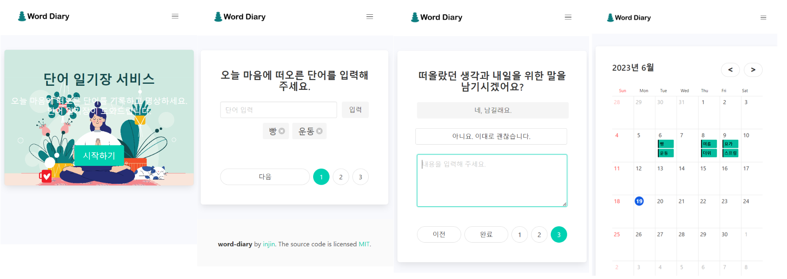

# word-diary

## 1. 개요

- 매일 마음에 떠오른 단어를 기록하는 앱
- 서비스 주소 : [word-diary.com](https://word-diary.com)

### 1.1 사용 기술

`Java` , `SpringBoot` , `Spring Data JPA` , `Thymeleaf` ,  `MySQL` , `AWS ElasticBeanstalk`

### 1.2 주요 화면

---

## 2. 제작노트
- [[ep0] 제작 의도](https://tozitizi.tistory.com/entry/단어-일기장-제작-의도)
- [[ep1] 오픈](https://tozitizi.tistory.com/entry/단어일기장-오픈)
